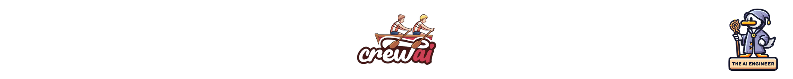

# CrewAI

## Overview
CrewAI lets you quickly build AI teams: Assign agents roles and goals. Equip them with tools. Define tasks. Orchestrate collaboration so the agents tackle problems together like a well-oiled crew.

## Description
CrewAI allows you to build sophisticated multi-agent systems that can collaborate to solve complex problems.

### 💡 CrewAI Key Highlights

✅ Role-Based Agents:
Customize autonomous agents with specific roles, goals, tools, and backstories that define their behavior.

✅ Flexible Task Management:
Dynamically create and assign tasks to agents based on their capabilities.

✅ Built-in Collaboration:
Agents can delegate tasks, share information, and request help from each other.

✅ Sequential Processes:
Define sequences of tasks that agents execute collaboratively by passing intermediate results between them.

✅ Bring Your Tools:
Equip agents with reusable capabilities from LangChain or create your custom tools.

✅ Human in the Loop:
Easily incorporate a human into an agent workflow to provide feedback.

With CrewAI's flexible building blocks and intelligent task orchestration, you can create an AI crew capable of tackling intricate problems in a coordinated way - like a team of human experts would. 👥

It enables new possibilities for sophisticated assistants, automated services, simulation environments, and more. An exciting framework for exploring collaborative AI!

### 🤔 Why should The AI Engineer care about CrewAI?
CrewAI moves much of the heavy lifting of coordinating AI agent interactions into a reusable package so engineers can focus on building sophisticated assistants and services more efficiently. The framework handles teamwork mechanics, enabling AI engineers to scale their ambitions for multi-agent systems.

✨ Enables Complex Collaboration:
CrewAI makes it easy to coordinate sophisticated multi-agent interactions for tackling complex tasks that are difficult for a single agent. 🤝

🚀 Saves Development Time:
The flexible building blocks and process management significantly reduce the effort required to orchestrate effective AI teamwork. ⏳

🧰 Tooling for Real-World Apps:
CrewAI provides the scaffolds and patterns for building real-world AI systems like assistants, services, simulations, etc. 🛠

🌟 Foster Emergent Intelligence:
By enabling collaboration, CrewAI unlocks new potential for intelligence to emerge from coordinating agents. 🧠

🔎 Exploration Platform:
It's an exciting platform for AI engineers to explore agent coordination mechanics and study collaborative intelligence. 👓

## 📊 Tell me more about CrewAI!
* 👷🏽‍♀️ Builders: João Moura, Greyson LaLonde
* 👩🏽‍💼 Builders on LinkedIn: https://www.linkedin.com/in/joaomdmoura, https://www.linkedin.com/in/greysonlalonde/
* 👩🏽‍🏭 Builders on X: https://twitter.com/joaomdmoura
* 👩🏽‍💻 Contributors: 16
* 💫 GitHub Stars: 4.6k
* 🍴 Forks: 470
* 👁️ Watch: 61
* 🪪 License: MIT
* 🔗 Links: Below 👇🏽

## 🖇️ Where can I find out more about CrewAI?
* GitHub Repository: https://github.com/joaomdmoura/crewAI
* Official Website: https://www.crewai.io/
https://www.producthunt.com/posts/crewai
* Discord Server: https://discord.com/invite/X4JWnZnxPb
* Profile in The AI Engineer: https://github.com/theaiengineer/awesome-opensource-ai-engineering/blob/main/libraries/crewai/README.md

---
👇🏽
🧙🏽 Follow [The AI Engineer](https://www.linkedin.com/company/theaiengineer/) for more about CrewAI and daily insights tailored to AI engineers. Subscribe to our [newsletter](http://theaiengineerco.substack.com). We are the AI community for hackers!

♻️ Repost this to help CrewAI become more popular. Support AI Open-Source Libraries!

⚠️ If you want me to highlight your favorite AI library, open-source or not, please share it in the comments section!