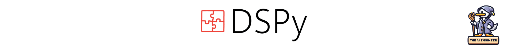

# DSPy

## Overview
DSPy lets you program pipelines with foundation models in Python without manual prompt engineering. It compiles your code into optimized prompts or finetunes tailored to your task, data and models. #AI

## Description
DSPy provides a modular Python framework for building pipelines with foundation models (LLMs, retrieval) without manual prompting. 👷‍♂️

### 💡 DSPy Key Highlights
✏️ Declarative Signatures - Concisely specify desired module behavior.

📝 Automatic Compilation - DSPy handles optimizing prompts or finetunes tailored to your program.

This means you can:

💻 Write pipeline code in easy Python modules (no prompts!) 🖥️

🔀 Flexibly compose and iterate on sections ➿

🔧 Add constraints and validate behavior ⚙️

🎚️ Supports GPT-3.5 down to small T5 and Llama2 locals

The result is simple, reusable programs that teach models new behaviors for your data and task - no manual prompt engineering needed! �b

Whether you're an ML researcher or startup builder, DSPy unlocks rapid innovation with foundation model pipelines. 🚀

### 🤔 Why should The AI Engineer care about DSPy?
1. 🔭 Abstraction - Focus on system architecture, not prompt tuning. Cleanly separate concerns.
2. ♻️ Reusability - Modules and programs can be reused across models and tasks. No duplication.
3. 💪 Maintainability - Changing data or models won't break prompts. Just recompile.
4. ☮️ Extensibility - Easily build on top of base modules to make new workflows.
5. ⏩ Productivity - Greatly speeds up iteration and innovation with foundation model pipelines.

In summary, DSPy greatly accelerates the process of constructing dependable, scalable software using large language models and retrieval methods. Automating the refinement of prompts substantially increases the efficiency and influence of AI engineers working on conversational artificial intelligence platforms.

## 📊 DSPy Stats
* 👷🏽‍♀️ Builders: Sri Vardhamanan A, Omar Khattab, Manish Shetty, Shangyin Tan
* 👩🏽‍💼 Builders on LinkedIn: https://www.linkedin.com/in/sri-vardhamanan-a-33b744155/, https://www.linkedin.com/in/omar-k-09747b188/, https://www.linkedin.com/in/manishshettym/, https://www.linkedin.com/in/shangyin-tan/
* 👩🏽‍🏭 Builders on X: https://twitter.com/SVardhamanan, https://twitter.com/lateinteraction, https://twitter.com/slimshetty_, https://twitter.com/ShangyinT
* 👩🏽‍💻 Contributors: 29
* 💫 GitHub Stars: 4.3k
* 🍴 Forks: 259
* 👁️ Watch: 84
* 🪪 License: MIT-License
* 🔗 Links: Below 👇🏽

## 🖇️ DSPy Links
* GitHub Repository: https://github.com/stanfordnlp/dspy
* X Page: https://twitter.com/lateinteraction/status/1694748401374490946
* Profile in The AI Engineer: https://github.com/theaiengineer/awesome-opensource-ai-engineering/blob/main/libraries/dspy.md

---
🧙🏽 Follow [The AI Engineer](https://www.linkedin.com/company/theaiengineer/) for more about DSPy and daily insights tailored to AI engineers. Subscribe to our [newsletter](http://theaiengineerco.substack.com). We are the AI community for hackers! We are the AI Ducktypers!

♻️ Repost this to help DSPy become more popular. Support AI Open-Source Libraries!

⚠️ If you want me to highlight your favorite AI library, open-source or not, please share it in the comments section!

