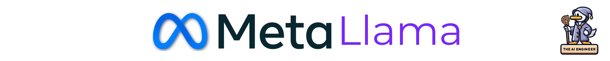

# Llama 2

## Overview
Llama 2 is Meta's open-source language model, now with 2T training tokens and up to 70B parameters. Includes pre-trained & helpfulness/safety fine-tuned versions to enable language capabilities across research & commercial use cases.
## Description

As one of the largest open-source language models out there, Llama 2 represents scale and performance. With up to 70 billion parameters trained on 2 trillion tokens - far surpassing the original Llama release - it demonstrates the power of open-source language models. 📈

🔬 As an open-source model, engineers can freely experiment to push boundaries in areas like multi-task learning, prompt programming, reinforcement learning, and beyond.

🛠️ Llama 2 provides both a 2T parameter pre-trained base model and 1M+ parameter helpfulness/safety fine-tuned versions in Llama Chat and Code Llama. It gives engineers an excellent starting point for customizing to their own use cases.

Whether through prompt programming techniques, adapter layers, decoder-only training, or full fine-tuning, the mix of model scales and specializations makes Llama 2 a versatile foundation for real-world applications. 👷‍♀️

### 💡 Llama 2 Key Highlights
🚀 State-of-the-Art Scale: Llama 2 pushes boundaries as one of the largest open-source language models, with up to 70 billion parameters trained on 2 trillion tokens.

🔬 Enabling Innovation: As an open-source model, Llama 2 fosters innovation by allowing engineers to freely experiment and build novel applications on top of its capabilities.

🌍 Accessibility: Llama 2 is designed for broad accessibility and democratizing the benefits of large language models by releasing it under a permissive license and across major cloud providers.

### 🤔 Why should The AI Engineer care about Llama 2?

1. 📈 Scale: With up to 70 billion parameters trained on 2 trillion tokens, Llama 2 pushes state-of-the-art scale for open-source language models. More parameters and data can enable more capable downstream applications.

2. 🔬 Innovation: As an open-source model, Llama 2 enables AI engineers to build novel applications and advance research on top of its capabilities. The open ecosystem fosters innovation.

3. ⚙️ Customization: Llama 2 releases include a pre-trained version and fine-tuned models for safety and helpfulness. It allows engineers to start customizing for their own use cases.

4. 🌎 Accessibility: Hosted by multiple cloud providers and available via a permissive license, Llama 2 is designed for broad accessibility to empower developers and researchers globally.

5. 👩‍💻 Community: There is great value in collaborating with the community building on top of Llama 2 - sharing ideas, best practices, benchmarks, and even additional training data.

## 📊 Tell me more about Llama 2!
* 👷🏽‍♀️ Builders: Joseph Spisak, sekyondaMeta, ruanslv, Suraj Subramanian
* 👩🏽‍💼 Builders on LinkedIn: https://www.linkedin.com/in/jspisak/, https://www.linkedin.com/in/surajsubramanian/
* 👩🏽‍🏭 Builders on X:https://twitter.com/joespeez, https://twitter.com/subramen
* 👩🏽‍💻 Contributors: 41
* 💫 GitHub Stars: 47.7k
* 🍴 Forks: 8.2
* 👁️ Watch: 469
* 🪪 License: LLAMA 2 COMMUNITY LICENSE AGREEMENT
* 🔗 Links: Below 👇🏽

## 🖇️ Where can I find out more about Llama 2?
* GitHub Repository: https://github.com/facebookresearch/llama
* Official Website: https://ai.meta.com/llama/
* Profile in The AI Engineer: https://github.com/theaiengineer/awesome-opensource-ai-engineering/blob/main/libraries/llama/README.md

---
🧙🏽 Follow [The AI Engineer](https://www.linkedin.com/company/theaiengineer/) for more about llama and daily insights tailored to AI engineers. Subscribe to our [newsletter](http://theaiengineerco.substack.com). We are the AI community for hackers!

♻️ Repost this to help llama become more popular. Support AI Open-Source Libraries!

⚠️ If you want me to highlight your favorite AI library, open-source or not, please share it in the comments section!