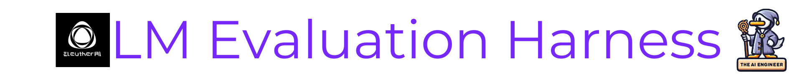

# LM Evaluation Harness

## Overview
The lm-evaluation-harness from EleutherAI offers a unified framework for testing autoregressive language models over hundreds of NLP benchmark tasks through a consistent Python interface or command line tool.

## Description
The lm-evaluation-harness 🔧, developed by EleutherAI, provides a standardized way for researchers to robustly evaluate autoregressive language models ⚙️ (LLMs) on a wide range of natural language tasks 🗣. As LLMs grow in size and capabilities, rigorously auditing their strengths and weaknesses has become challenging yet increasingly crucial.

This open-source library tackles these problems by supplying a unified interface for testing LLMs on over 200 NLP benchmarks 📊, spanning areas like question answering, common sense reasoning, summarization, translation, and more. Researchers can evaluate models hosted locally or on APIs using the same codebase and inputs.

Whether you've built an LLM and want to benchmark it or are looking to reproduce results from a paper, the lm-evaluation-harness simplifies the process. Features like automatic batch size detection, model result caching 💾, and built-in parallelization make it easy to use. The library also enables customizable prompting and implements dataset decontamination 🔬 to limit train/test data leakage.

With over 100 citations in the last year, the lm-evaluation-harness has become a crucial tool for rigorously measuring and comparing progress in language models. Contributors welcome!

So, if you're working with LLMs, lm-evaluation-harness provides a standardized way to audit these models as they continue to grow ever more powerful.

### 💡 LM Evaluation Harness Key Highlights
1. 📊 Unified framework to evaluate language models on over 200 NLP benchmark tasks
2. 🔎 Enables reproducible testing by using the same inputs and codebase across models
3. ⚡️Easy to use features like auto batching, caching, and parallelization to accelerate benchmarking

### 🤔 Why should The AI Engineer care about LM Evaluation Harness?

1. ⛓️ Standardizes evaluation across models and papers to enable fair comparison
2. 📈 Quantifies progress in capabilities like reasoning and robustness crucial for real-world use
3. 🔬 Checks for training data contamination to measure true generalization
4. ⏱️ Accelerates benchmarking via auto batching, caching, parallelization
5. 🛠️ Customizable prompting and metrics to focus on strengths/weaknesses

The evaluation harness provides a robust, extensible framework for rigorously auditing autoregressive language models. Systematizing evaluation facilitates reproducible measurements of progress in critical areas like logic, common sense, and overfitting. The harness streamlines tedious evaluation workflows so engineers can iterate faster. With customizable configurations, engineers also understand how models generalize, where they struggle, and how evaluation choices impact results. Standardized insights empower the building of more reliable, trustworthy AI systems.

## 📊 Tell me more about lm-evaluation-harness!
* 👷🏽‍♀️ Builders: Lintang Sutawika, Hailey Schoelkopf, Leo Gao, Jonathan Tow
* 👩🏽‍💼 Builders on LinkedIn: https://www.linkedin.com/in/lintang-sutawika/, https://www.linkedin.com/in/hailey-schoelkopf-070361286/, https://www.linkedin.com/in/xiaoyu-gao-501380/, https://www.linkedin.com/in/jonathan-tow-2353b628b/
* 👩🏽‍🏭 Builders on X: https://twitter.com/lintangsutawika, https://twitter.com/haileysch__, https://twitter.com/nabla_theta, https://twitter.com/jonbtow
* 👩🏽‍💻 Contributors: 92 
* 💫 GitHub Stars: 3.3k
* 🍴 Forks: 857
* 👁️ Watch: 31
* 🪪 License: MIT
* 🔗 Links: Below 👇🏽

## 🖇️ Where can I find out more about LM Evaluation Harness?
* GitHub Repository: https://github.com/EleutherAI/lm-evaluation-harness
* Official Website: https://www.eleuther.ai/projects/large-language-model-evaluation
* LinkedIn Page: https://www.linkedin.com/company/eleutherai/
* X Page: https://twitter.com/AiEleuther
* Discord Server: https://discord.com/invite/zBGx3azzUn
* Profile in The AI Engineer: https://github.com/theaiengineer/awesome-opensource-ai-engineering/blob/main/libraries/lm-evaluation-harness/README.md

---
🧙🏽 Follow [The AI Engineer](https://www.linkedin.com/company/theaiengineer/) for more about LM Evaluation Harness and daily insights tailored to AI engineers. Subscribe to our [newsletter](http://theaiengineerco.substack.com). We are the AI community for hackers!

♻️ Repost this to help lm-evaluation-harness become more popular. Support AI Open-Source Libraries!

⚠️ If you want me to highlight your favorite AI library, open-source or not, please share it in the comments section!
