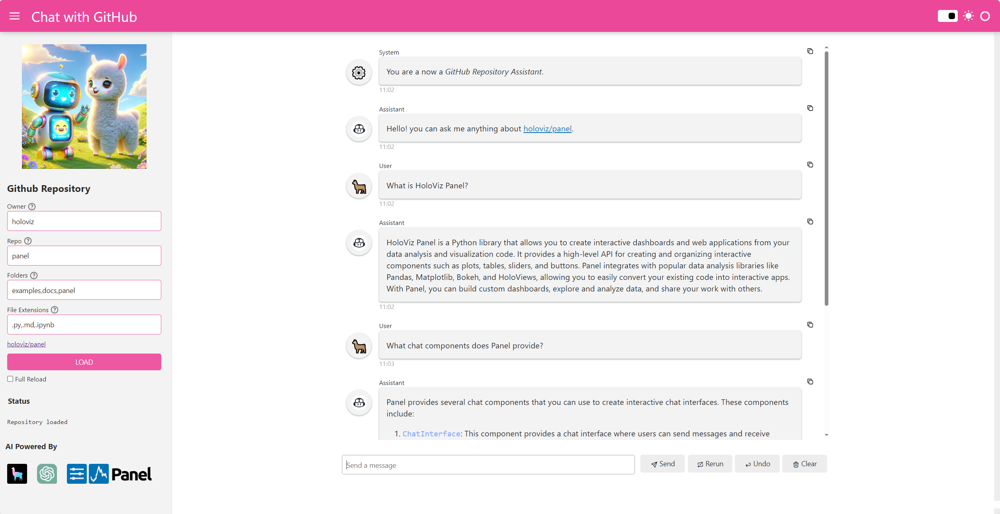
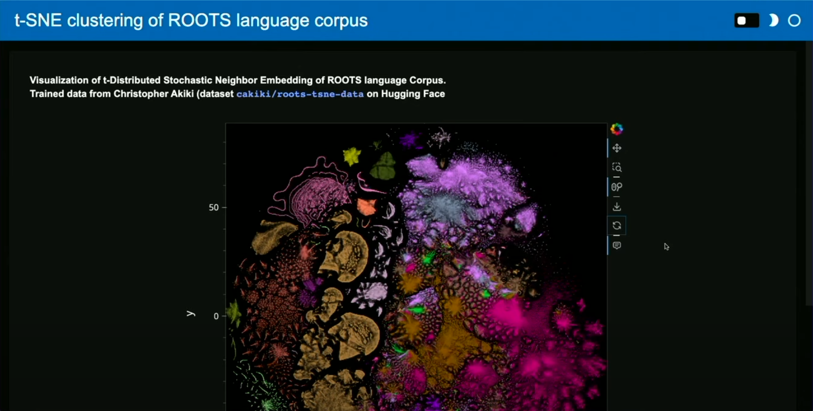
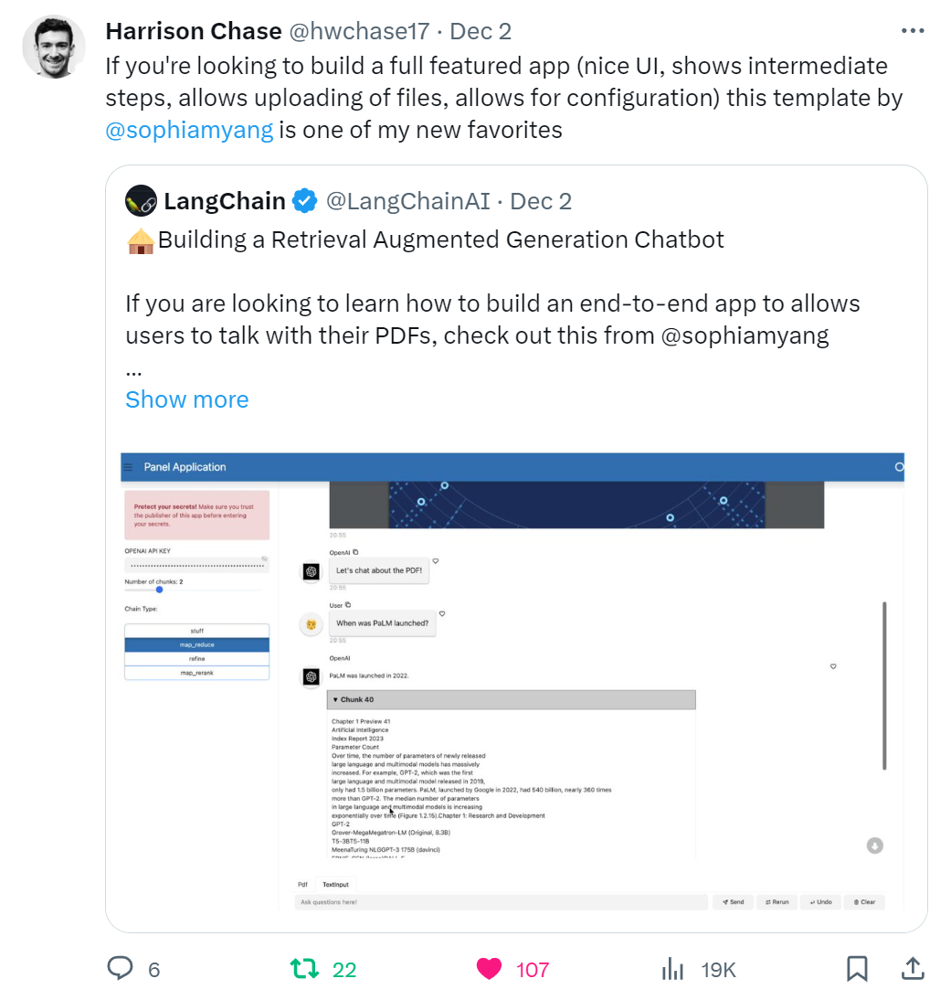
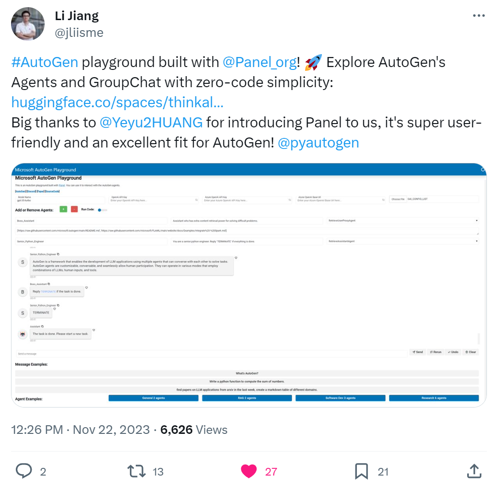

# Panel

## Overview

[Panel](https://panel.holoviz.org/reference/index.html) lets you easily **build AI powered tools, chat interfaces and applications entirely in Python**.

## Description

Panel is an open-source and free Python library that lets you easily build AI powered tools, chat interfaces and applications entirely in Python. It has a batteries-included philosophy, putting the PyData ecosystem, powerful data tables and much more at your fingertips. High-level reactive APIs and lower-level callback based APIs ensure you can quickly build exploratory applications, but you aren’t limited if you build complex, multi-page apps with rich interactivity.

### 💡 Key Highlights

⚡ Easily turn your data and models into powerful AI powered applications.

🔋 Its *batteries included philosophy* enables you to build multi-modal applications.

🤖 Provides powerful chat components

🦜 Show *chain of thought* with the LangChain callback handler.

📓 Develop in the notebook or your editor of choice

Panel is a member of the [HoloViz](https://holoviz.org/) ecosystem of dataviz frameworks. It supports even the the most advanced dataviz use cases. For example you can visualize the biggest datasets interactively in combination with its sister framework [Datashader](https://datashader.org/).

### 🤔 Why should The AI Engineer care about Panel?

Because

- Panel gives the AI Engineer super powers.
- [Deeplearning.AI](https://www.deeplearning.ai/) by Andrew Ng uses Panel to teach AI Engineers how to build chat applications.
- It is a favorite of Harrison Chase, CEO and founder of LangChain.
- Autogen use it to demo their agents and group chat.

## 📊 Panel Stats

* 👷🏽‍♀️ Builders: [Philipp Rudiger](https://github.com/philippjfr), [Marc Skov Madsen](https://github.com/MarcSkovMadsen), [Simon Høxbro Hansen](https://github.com/Hoxbro), [Maxime Liquet](https://github.com/maximlt), [Andrew Huang](https://github.com/ahuang11), [Sophia Yang](https://github.com/sophiamyang)
* 👩🏽‍💼 Builders on LinkedIn: [philippjfr](https://www.linkedin.com/in/philippjfr/), [marcskovmadsen](https://www.linkedin.com/in/marcskovmadsen/), [hoxbro](https://www.linkedin.com/in/hoxbro/), [maxime](https://www.linkedin.com/in/maxime-liquet/), [haungandrew12](https://www.linkedin.com/in/huangandrew12/), [sophiamyang](https://www.linkedin.com/in/sophiamyang/)
* 👩🏽‍🏭 Builders on Twitter: [PhilippJFR](https://twitter.com/PhilippJFR), [Marc Skov Madsen](https://twitter.com/MarcSkovMadsen), [MaximeLiquet](https://twitter.com/MaximeLiquet), [IAteAnDrew1](https://twitter.com/IAteAnDrew1), [sophiamyang](https://twitter.com/sophiamyang)
* 👩🏽‍💻 Contributors: 152
* 💫 GitHub Stars: 3.4k
* 🍴 Forks: 406
* 👁️ Watch: 52
* 🪪 License: BSD 3-Clause
* 🔗 Links: Below 👇🏽

## 🖇️ Panel Links

Check out [Panel-Chat-Examples](https://holoviz-topics.github.io/panel-chat-examples/) and

* GitHub Repository: https://github.com/holoviz/panel
* Official Website: https://panel.holoviz.org/index.html
* Twitter account: https://twitter.com/Panel_org
* LinkedIn account: https://www.linkedin.com/company/panel-org/
* Profile in The AI Engineer: https://github.com/theaiengineer/awesome-opensource-ai-engineering/blob/main/libraries/panel.md

---
🧙🏽 Follow [The AI Engineer](https://www.linkedin.com/company/theaiengineer/) for daily insights tailored to AI engineers and subscribe to our [newsletter](http://theaiengineerco.substack.com). We are the AI community for hackers!

⚠️ If you want me to highlight your favorite AI library, open-source or not, please share it in the comments section!
