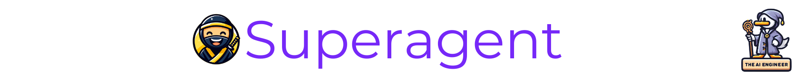

# Superagent

## Overview
Superagent is an open framework for easily integrating production-ready AI assistants & chatbots into any app in minutes. Handles infra, data, models so you can focus on capabilities. #AI

## Description
Superagent provides an open-source framework for rapidly developing production-grade AI assistants and embedding them into any application. 🤖

It abstracts away all infrastructure, dependencies, and configurations - enabling engineers to focus entirely on high-level capabilities. ✨

### 💡 Superagent Key Highlights

Under the hood, Superagent handles:

🗄️ Ingesting & Preparing Data
- Structured data like CSVs
- Unstructured data like PDFs and webpages
- Chunking and vectorization for retrieval
- Fine-tuning agents on custom data

🔌 Connecting External Tools & APIs
- Expand capabilities with 3rd party services
- Catalog of ready tools like ChatGPT plugins and more
- Flexible configuration

⚙️ Optimization & Reliability
- Concurrency, caching, workflows
- Runs on FastAPI and other robust frameworks
- Deploys easily to Vercel, AWS, GCP

📈 Observability
- OpenTelemetry integration
- Native support for Langsmith and Langfuse

The goal is to enable anyone to build everything from QA bots 🤖 to custom digital assistants in minutes without expertise.

Whether creating a next-gen ChatGPT for your product or leveraging LLMs for workflows, Superagent provides the simplest path to building and scaling.

### 🤔 Why should The AI Engineer care about Superagent?

1. ⚡️ Speed - Go from idea to production AI assistant in minutes instead of months.
2. 🔭 Abstraction - Focus on capabilities rather than infra or ops.
3. ⚙️ Flexibility - Easily swap out models, data sources, and tools. Great for testing ideas.
4. 💪 Reliability - Battle-tested foundations like FastAPI enable scale.
5. 🤝 Community - Be part of innovating the next generation of assistants.

In summary, Superagent enables engineers to build quickly with reduced complexity. By handling the undifferentiated heavy lifting, it allows one to focus innovation on the user experience and problem solving.

## 📊 Superagent Stats
* 👷🏽‍♀️ Builders: Ismail Pelaseyed, Alan Zabihi, Deep Singhvi, Trivikram Kamat
* 👩🏽‍💼 Builders on LinkedIn: https://www.linkedin.com/in/pelaseyed, https://www.linkedin.com/in/alanzabihi/, https://www.linkedin.com/in/deep-singhvi-1432659b/, https://www.linkedin.com/in/trivikramkamat/
* 👩🏽‍🏭 Builders on X: https://twitter.com/pelaseyed, https://twitter.com/DeepSinghvi, https://twitter.com/trivikram, https://twitter.com/alanzabihi
* 👩🏽‍💻 Contributors: 47
* 💫 GitHub Stars: 3.3k
* 🍴 Forks: 644
* 👁️ Watch: 42
* 🪪 License: MIT
* 🔗 Links: Below 👇🏽

## 🖇️ Superagent Links
* GitHub Repository: https://github.com/homanp/superagent
* Official Website: https://www.superagent.sh/
* Discord Server: https://discord.gg/mhmJUTjW4b
* LinkedIn Page: https://www.linkedin.com/company/superagent-sh/
* Profile in The AI Engineer: https://github.com/theaiengineer/awesome-opensource-ai-engineering/blob/main/libraries/superagent.md

---
🧙🏽 Follow [The AI Engineer](https://www.linkedin.com/company/theaiengineer/) for more about Superagent and daily insights tailored to AI engineers. Subscribe to our [newsletter](http://theaiengineerco.substack.com). We are the AI community for hackers!

♻️ Repost this to help Superagent become more popular. Support AI Open-Source Libraries!

⚠️ If you want me to highlight your favorite AI library, open-source or not, please share it in the comments section!
